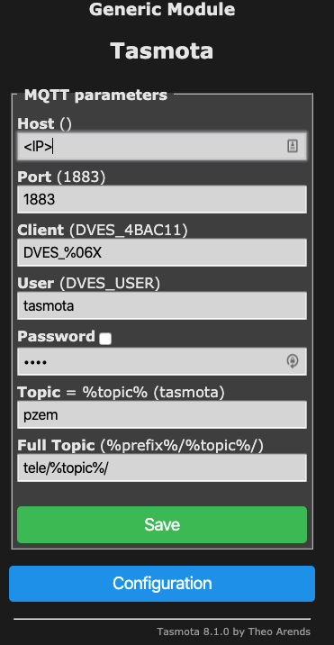
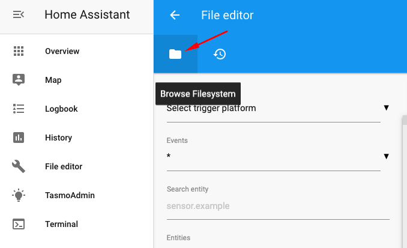
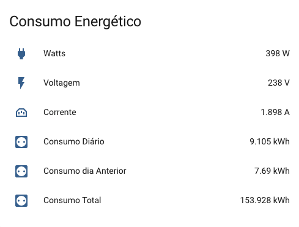
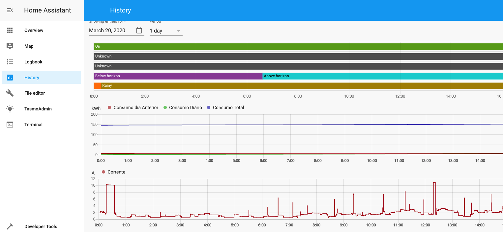

# Power Consumption Meter Project

## 1 - Introduction

The purpose of this repo is to describe the steps of creating a budget power consumption meter for your home (or any circuit up to 100A).

This is part of a bigger project (under development) for the installation of a self-production energy module. Measure power consumption is part of the initial assessment for proper dimensioning of the system and, moving forward, to measure the production as well.

Note: All work was done using MacOS and it will be the reference in this project.

## **2 - Architecture**

### **2.1 - Overview**

There are two main functionalities required for the Power Consumption meter: measure and display information.
For the measure part, after some search, the module Peacefair PZEM-004T kept poping up. Its a module capable of readings up to 100A using either a whole or split core.

For more versatability and mobility with the PZEM-004T, most solutions seen would join it with anything with an ESP8266, such as a Sonoff Basic, for easy programability and WiFi capabilities.
The Sonoff Basic was chosen as it can easely be flashed with a custom firmware (Tasmota) which would bring the programability and functionalities lacking in the PZEM-004T and also proven to be a cost efective hardware with an ESP8266.

The meaurement part is therefore accomplished by using the PZEM and the Sonoff integrated, providing not only the measurement part but also integrated with an MQTT Client (within Tasmota) capable to send data to a MQTT Broker.

For data storage and visualization the option fell within Hass.io HomeAssistant installed on a (reporpused) Raspberry Pi 3.
HomeAssistant seems to have a growing community with plenty of plugins for a multitude of porpuses, mainly focused on Home Automation but also capable of data storage and viewability.

### **2.2 - BoM (Bill of Materials)**

This is a full bill of materials used but only a few were bought for the project as, mostly on the RPI side, I had everything (all items unitary unless otherwise mentioned).

| Item  |  Short Description  |   Bought For Project?  |
| ------------------- | ------------------- | ------------------- |
|  Raspberry Pi 3+  |  Module to run HomeAssistant | No |
|  RPI Power Module 2.4V  |  Power the RPI | No |
|  16GB Micro SD Card  |  Required for OS install/Run | No |
|  PZEM-004T with Split-Core  |  Power Measurement | Yes |
|  Sonoff Basic  |  WiFi Module | Yes |
|  1k Ohm Resistance  |  Required PZEM004 and Sonoff integration | Yes |
|  PCB Pin Headers (x 4)  |  To Solder to Sonoff Basic's GPIOs | Yes |
|  Dupont Cable F2F (x 4)  |  To Solder to Sonoff Basic's GPIOs | No |
|  USB To TTL Adapter  |  Used to flash Sonoff Basic | Yes |
|  Schuko Plug with 2m wire  |  Power Supply for PZEM/Sonoff | Yes |

NOTE: Not considering any tools used (multimeter, wire crimpers/clipers, solder iron etc)

Overall spent around 16€ with all the materials bought for the project. Of course the most expensive component is the RPI (and related items) which I already had but can add an extra 50€.

### **2.3 - Sonoff Basic**

Sonoff Basic is a well known module used to create a switch within any circuit (<10A) for automation. Its a rather cheap module that brings with it a ESP8266 module which means it is flashable with [Tasmota](https://github.com/arendst/Tasmota), a custom firmware for ESP8266 modules.

The Sonoff Basic has currently 3 known hardware revisions: R1, R2 and R3.

**The HW version used in this project was R2.** The versions can be easely recognized following the instructions on [this link](https://github.com/arendst/Tasmota/wiki/Sonoff-Basic).

**Why Tasmota?**

We will need both to communicate with the PZEM-004T module through the TTL Serial interface and on the other end to deliver the data to HomeAssistant MQTT Broker and the original firmware is not suited for that purpose.

On top of that, Tasmota has all the features the original firmware has (i.e.: switch) when accessed directly or with HomeAssistant.

### **2.4 - PZEM-004T**

The Peacefair PZEM-004T is a reader of electrical related indicators such as Voltage, Current and Frequency. Its capable of up to 10 Amps without any external measurement aid and if used a closed or split coil it can go up to 100 Amps.

For this project it was used a PZEM-004T version 3 (as oposed to older Version 1) and a Split Coil transformer.

There is a great website with tons of information regarding the PZEM, including the data-sheet and wiring information available at [InnovatorsGuru](https://www.innovatorsguru.com/pzem-004t-v3/).

### **2.5 - Home Assistant**

Home Assistant calls itself the "ultimate home automation hub". It is an open source software with a active and growing community that features an easy to install automation platform for devices that somehow provide an API that can be used. It is also usefull as a data broker (MQTT Broker) and storage/visualization either out of the box or with its plugins (such as InfluxDB and Grafana).

For this project we will use just set it up and configure as MQTT Broker for the data coming from the PZEM/Tasmota and provide some level of data visualization.

## **3 - Implementation**

This section will detail de steps (or where to find them) for setup each component of the solution and in the end cover the integration of all the parts.

### **3.1 - Sonoff Basic**

#### 3.1.1 - Soldering Pin Heads to the PCB GPIO's

Some of the GPIOs in this board will actively be used both to flash and to connect to PZEM Module for data communication.

Its adviced to solder 4 pin heads to the required ports before moving forward.

If you turn the Sonoff upside down you will see in the midle of the PCB 4 GPIOs named: GND, TX, RX and 3V3. These are the ones to have soldered pin heads.


*Sonoff Basic R2 rear PCB view and location of the 4 GPIOs. Image from [Tasmota Github](https://github.com/arendst/Tasmota/wiki/Sonoff-Basic)*

#### 3.1.2 - Backup Current Sonoff Firmware (optional)

This step is optional not only because you might not want to get back to the previous original firmware but also because there is a page which provides a guide and some backups from Sonoff devices, including the Sonoff Basic R2.
That page is [Hobbytronics Blog](https://blog.hobbytronics.pk/sonoff-original-firmware-backup-restore/#Backup-Download-Official-Firmware).

**Pre-Requirements**

Install Python on your laptop.

1. Install esptool:

    ````
    $ pip install esptool
    ````

2. Set the ttl-USB dongle to 3V (usually has a jumper to select between 5V and 3V);

3. Wire the TTL-USB dongle to sonoff:

   | USB TTL |	Sonoff |
   | --| -- |
   GND |	GND
   VCC	| 3V3
   TXD	| RX
   RXD |	TX

4. Connect the TTL-USB and Sonoff in programming mode:

   Press the black button on Sonoff and connect the TTL-USB device to the MAC, after connecting, release the black button

5. Find which USB port is the TTL-USB device (should see 2 with same ID, refers to same device)

   ````
   $ ls /dev/ | grep serial
   cu.usbserial-14110
   tty.usbserial-14110
   `````

6. Execute the esptool comand to backup the firmware:

    ````
    $ esptool.py --port /dev/tty.usbserial-14110 read_flash 0x00000 0x100000 sonoff_basic_R2image1M.bin


    esptool.py v2.8
    Serial port /dev/tty.usbserial-14110
    Connecting....
    Detecting chip type... ESP8266
    Chip is ESP8285
    Features: WiFi, Embedded Flash
    Crystal is 26MHz
    MAC: 24:62:ab:4b:ac:11
    Uploading stub...
    Running stub...
    Stub running...
    1048576 (100 %)
    1048576 (100 %)
    Read 1048576 bytes at 0x0 in 95.7 seconds (87.6 kbit/s)...
    Hard resetting via RTS pin...
    ````
7. The operation should be complete within couple of minutes. Validate that the file sonoff_basic_R2image1M.bin is in your filesystem.

#### 3.1.3 - Flash Tasmota Firmware

1. Here all I have to say is to follow the instructions from [this excelent Medium Post from Jordan Rounds](https://medium.com/@jordanrounds/sonoff-basic-r2-tasmota-aa6f9d4e033f) untill the section "Open Tasmota".
 

#### 3.1.4 - Configure Tasmota

You should have followed all the steps in the previous section untill the point your Sonoff/Tasmota is connected to your wireless network and has a certain known IP Address (it is up tou you to provide a static IP on your router if you desire so).

1. Access to your Tasmota through a web browser using it's IP Address;

2. Configure the logging by going to the "Configuration" button then "Configure Logging" menu and filling it up as the following image shows. In the end hit the Save button (Sonoff will restart afterwards);

   

   

   Serial and Syslog loggings is disable while web log is at level 2. Telemetry period is the rate MQTT data is sent and is set to 15 seconds.

3. Configure the module, preparing already for the integration with PZEM, with the required GPIOs functions. For that access the "Configuration" menu and then "Configure Module" and apply the values as shown in the following image;

   
````
   TX GPIO1  -> Select "PZEM0XX Tx (62)
   RX GPIO3  -> Select "PZEM016 Rx (98)
   D6 GPIO12 -> Select "Relay1 (21)
`````
   The D6 GPIO12 is optional since its only to be able to controll the power switch of the Sonoff. In case you don't want to use it, leave it at None (0).

   **Note:** RX GPIO3 value is (98) for integrations with PZEM004T Version 3. In case it is the older version 1 it should be set to option PZEM004 Rx (63) instead.

For now thats all with the Tasmota, further configs explained during integration.

### **3.2 - PZEM-004**

The PZEM has litle to be done in preparation for the integration but for those who don't like soldering it might be enough. :)
Due to the different serial voltage on both Sonoff (3.3V) and the PZEM module (5V), it's value must be adjusted.

The easiest way might be creating a tension divider.

The tutorial available at the [Wiki Article on Tasmota GitHub](https://github.com/arendst/Tasmota/wiki/PZEM004T-Energy-Monitor) explains this perfectly.

Basically the 1K Ohm resistor needs to be soldered as shown in the following image.


*PZEM004T Soldered resistor for voltage dividor [Tasmota Github](https://github.com/arendst/Tasmota/wiki/PZEM004T-Energy-Monitor)*

### **3.3 - Home Assistant**

#### 3.3.1 Install Home Assistant on Raspberry Pi

Have a 16GB card ready to flash the latest Home Assistant by following [this guide](https://www.home-assistant.io/getting-started).

After following the installation rules follow as well the ["On-Board" initial steps](https://www.home-assistant.io/getting-started/onboarding/) that guide through creating an account (but detection of devices in your network can be ignored).

#### 3.3.2 Install Required Add-Ons on Home Assistant

There are a couple of required Add-ons that need to be installed and other two that can be installed optionally (will only mention the purpose but not guide on them):


   | Add-on Name |	Required? | Description |
   | --| -- | -- |
   | Mosquito Broker | Yes | MQTT Broker required for Tasmotta communication | 
   | File Editor | Yes | HA GUI integrated file editor | 
   | Duck DNS | No | Easy DynDNS solution for HA | 
   | TasmoAdmin | No | Manage Tasmota devices on your network | 

1. To install the abovementioned required (or optional) add-ons, log-in onto HA and access "Supervisor" on the left Side menu and then the "Add-On Store" tab (or http://homeassistant:8123 );

2. For each add-on, click on it and press "install";

3. After Install is complete, select "Start on Boot" on;

4. "Start" the add-on;

   
*After following the above steps, the Add-on details should look like the above image*


### **3.4 - Integration**

The final part is physically and logically integrate the 3 main components toguether to get the end result.

#### 3.4.1 - Wiring

There are two parts of the wiring: Electrical and Serial Interface.

 
*Wiring Diagram*

**1. Serial Interface Wiring**

Make sure you have already soldered the resistor on the PZEM to adjust the Serial voltage and also that you have the pinheads soldered on sonoff.

Using the Dupont Cables F2F, connect the Sonoff and the PZEM serial interface following the diagram and/or the next table as reference.

   | PZEM |	Sonoff |
   | --| -- |
   GND |	GND
   5V	| 3.3V
   TX	| RX
   RX |	TX

**2. Electrical Wiring**

2.1 Use the Schuko Plug with the wire bought and cut according to you needs, at least cut a small 10cm part of it to make the connector between the Sonoff and Pzem;

2.2 Connect the oposite end of the schucko to the Sonoff's Input as shown in the diagram (blue is the neutral and brown the line);

2.3 With the short 10cm part of the cable, wire the Sonoff's output to the PZEM Input as show in the diagram;

2.4 Finally, connect the Coil to the remaining ports of the PZEM as shown in the diagram;

 
*Wiring Photo*

**3. Plug**

With all the wiring done, make sure you have the boards on a stable surface without any metal.

Safelly plug the shucko into the wall socket and check that the leds on the PZEM start to blip. If they don't, don't stress yet as the Sonoff switch might be off. 

Next section we will cover the switch provision as this design left the main circuit go through the Sonoff so it gives the flexebility to cut power from the PZEM at any given time.

#### 3.4.2 - Sonoff/Tasmota Integration

##### 3.4.2.1 - Sonoff Switch

As mentioned in the previous section, the switch might be disabled at start. To test if the PZEM is working (in case it didn't light up once you plugged) go to your tasmota web page and check if just above the "Toggle" button it says "ON" of "OFF". If it says "OFF", just press the "Toggle" button and it should switch, powering the PZEM.

 
*Tasmota main screen*

In order for the switch to be "ON" by default we can use the web request directly like this:

`````
curl http://tasmota_IP/cm?cmnd=PowerOnState%20ON
`````
This command sets the switch to be by default "ON" uppon turned on.

To check the status you can use the following command (should show "PowerOnState":1 where '1' means ON):

`````
curl http://tasmota_IP/cm?cmnd=PowerOnState
{"PowerOnState":1}
`````

##### 3.4.2.2 - MQTT Broker Configuration

To configure the MQTT Broker (Mosquitto that was installed on Raspberry Pi) go to Configure > Configure MQTT and the fill in the parameters as follows:

   | Atribute |	Value |
   | --| -- |
   Host | Your RPI IP address (or hostname)
   Port	| 1883
   Client	| (leave value)
   User |	tasmota 
   Password |	-
   Topic	| pzem
   Full Topic | tele/%topic%/

 

*Tasmota MQTT Config*

Now hit "Save" button and go back to Tasmota's main menu.
Go to "Console" menu and check it connected sucessfully to the MQTT Server and it is transmitting MQTT data to both tele/pzem/STATE and tele/pzem/SENSOR collections.

#### 3.4.3 - Home Assistant Integration

The final piece in the puzzle is to configure the Tasmotta to read the information from the MQTT Broker (Mosquitto).


##### 3.4.3.1 - Edit /config/configuration.yaml

1. Open the File Editor add-on and click on the "folder icon" to search for the /config/configuration.yaml file;

 

2. Once opened the configuration.yaml file, add the sensor information bellow to the file:

   `````
   sensor:

   - platform: mqtt
      name: "Watts"
      state_topic: "tele/pzem/SENSOR"
      value_template: "{{ value_json.ENERGY.Power }}"
      unit_of_measurement: "W"
      icon: mdi:power-plug

   - platform: mqtt
      name: "Voltage"
      state_topic: "tele/pzem/SENSOR"
      value_template: "{{ value_json.ENERGY.Voltage }}"
      unit_of_measurement: "V"
      icon: mdi:flash

   - platform: mqtt
      name: "Current"
      state_topic: "tele/pzem/SENSOR"
      value_template: "{{ value_json.ENERGY.Current }}"
      unit_of_measurement: "A"
      icon: mdi:power-socket


   - platform: mqtt
      name: "Dailly Consumption"
      state_topic: "tele/pzem/SENSOR"
      value_template: "{{ value_json.ENERGY.Today }}"
      unit_of_measurement: "kWh"
      icon: mdi:power-socket-eu

   - platform: mqtt
      name: "Previous Day Consumption"
      state_topic: "tele/pzem/SENSOR"
      value_template: "{{ value_json.ENERGY.Yesterday }}"
      unit_of_measurement: "kWh"
      icon: mdi:power-socket-eu

   - platform: mqtt
      name: "Total Consumption"
      state_topic: "tele/pzem/SENSOR"
      value_template: "{{ value_json.ENERGY.Total }}"
      unit_of_measurement: "kWh"
      icon: mdi:power-socket-eu

   `````
3. Save the file by clicking the save icon on top right screen;

##### 3.4.3.2 - Edit /config/groups.yaml

1. Open the File Editor add-on and click on the "folder icon" to search for the /config/groups.yaml file;

2. Once opened the groups.yaml file, add the sensor information bellow to the file:

   `````
   energy:
    view: yes
    icon: mdi:power-socket
    entities:
      - group.energygroup

   energygroup:
    control: hidden
    name: Energy Consumption
    entities:
      - sensor.watts
      - sensor.voltage
      - sensor.current
      - sensor.dailly_consumption
      - sensor.previous_day_consumption
      - sensor.total_consumption
   `````
3. Save the file by clicking the save icon on top right screen;


##### 3.4.3.3 - Check Home Screen

If all went well you should now be able to see in the main screen the data from PZEM and graphics. If selecting the "History" tab on the left bar, will have more graphis and greater detail. :)

 

 

## ** Final notes / Ackowledgments **

Not being a true electronics geek has its shortcomings so apologies for any misconcepts/errors on the guide.

To report any issues use the github "Issues" feature and I'll do my best to answer or update the guide.

Many guides were used to seek information and details and since a few were already mentioned during the guide but there is one important missing:

[Portuguese Home Assistant Community](https://forum.cpha.pt/t/como-instalar-e-configurar-um-medidor-de-energia-pzem-004t/540) - This was the first guide pointing to the PZEM I read and triggered the project. Many Thanks :)
